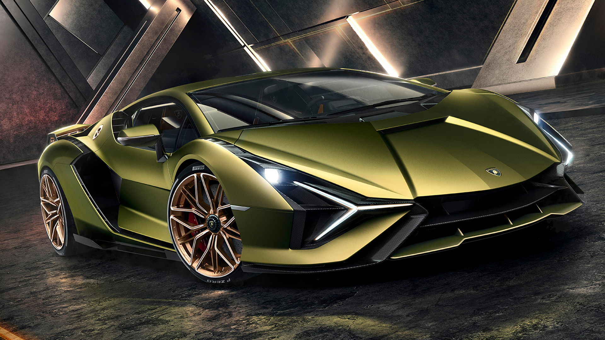

# Lamborghini Sian 

***

### **Обзор**

Sián — первый суперспорткар, оснащенный двигателем V12 с гибридной технологией на основе суперконденсаторов. Сочетание мощи, красоты и культового двигателя V12 в комбинации с электрическим бустером заключены в этом непревзойденном чуде инженерной технологии.

### *Экстерьер*
Выполненный из углеродного волокна монокок, электрохромная крыша и подвижные поверхности созданы с применением интеллектуальных инновационных материалов.

### *Интерьер*
Интерьер разработан так, чтобы впечатления от вождения всегда оставались на высочайшем уровне: прилив адреналина вместе с захватывающим ощущением при ускорении.

***Характеристики***
- макимальная скорость: 355 км/ч
- число цилиндров: 12
- макс. момент: 720 Нм
- Макс. мощность: 819CV

Информация с [сайта Lamborghini](https://www.lamborghini.com)